<div align="center">

# PCVerse — Atlas maszyny

**Interaktywny model 3D peceta. Rozłóż go na części, prześledź drogę danych, sprawdź, co spowalnia maszynę, i złóż ją samodzielnie.**

[**▶ Otwórz demo**](https://apkmason.dev/pcverse-v2/) · React · Three.js · React Three Fiber · Blender · WebGL

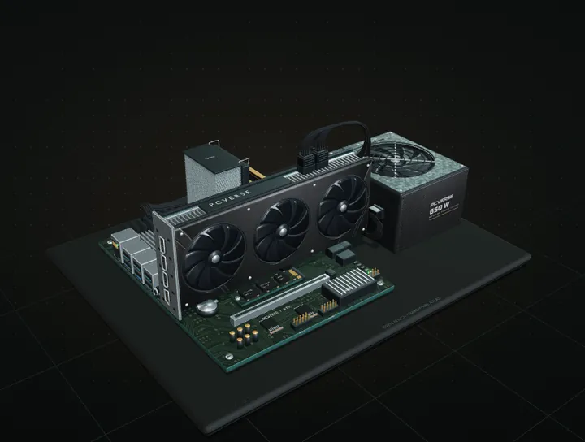

</div>

## Cztery kanały

| Anatomia | Droga danych | Laboratorium |
| --- | --- | --- |
| 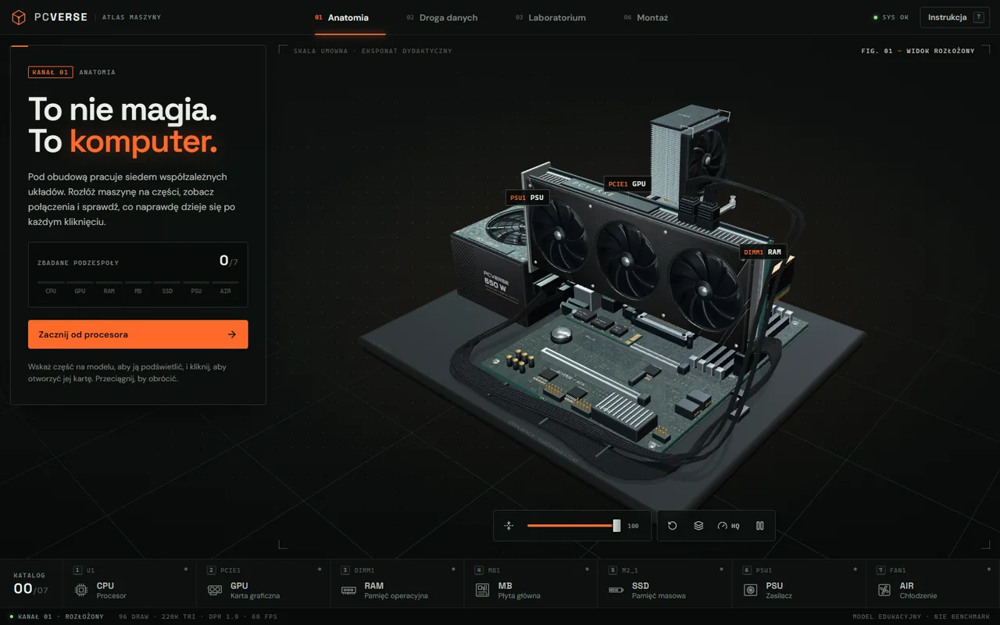 | 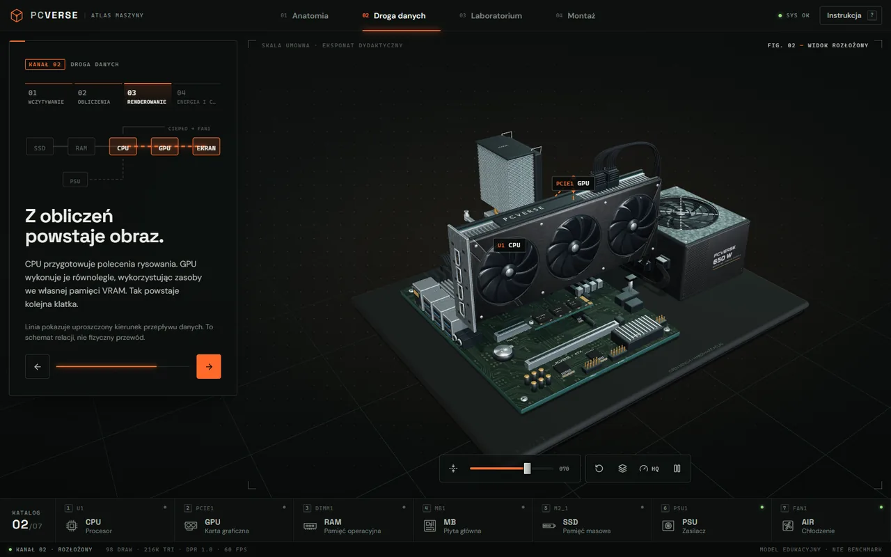 | 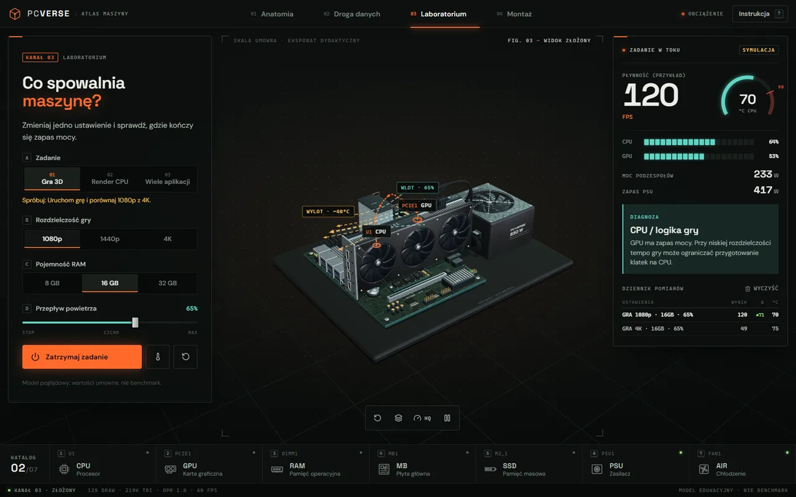 |
| Siedem podzespołów z kartami katalogowymi, podświetlaniem pod kursorem, widokiem rozłożonym i oglądaniem z bliska: przód, tył, góra, spód, złącza. | Cztery etapy od wczytania pliku z SSD po obraz na ekranie, z zasilaniem i ciepłem w tle. Na końcu test wiedzy. | Gra, render lub wiele aplikacji. Zmieniasz rozdzielczość, RAM i przepływ powietrza, a telemetria, dziennik pomiarów i termowizja pokazują skutki. |

### Termowizja

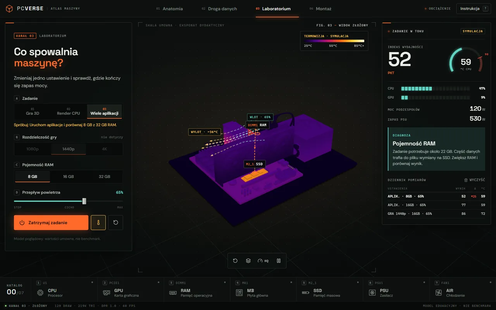

Przełącznik termowizji (klawisz T) zamienia model w obraz z kamery termicznej, wyliczany z tego samego modelu co wyniki laboratorium. Karta nagrzewa się z rozdzielczością, wieża chłodzenia jest gorętsza przy podstawie niż na żeberkach i stygnie z przepływem powietrza, zasilacz grzeje się z pobieraną mocą, a przy braku RAM widać, jak pracujący plik wymiany rozgrzewa dysk SSD.

### Montaż

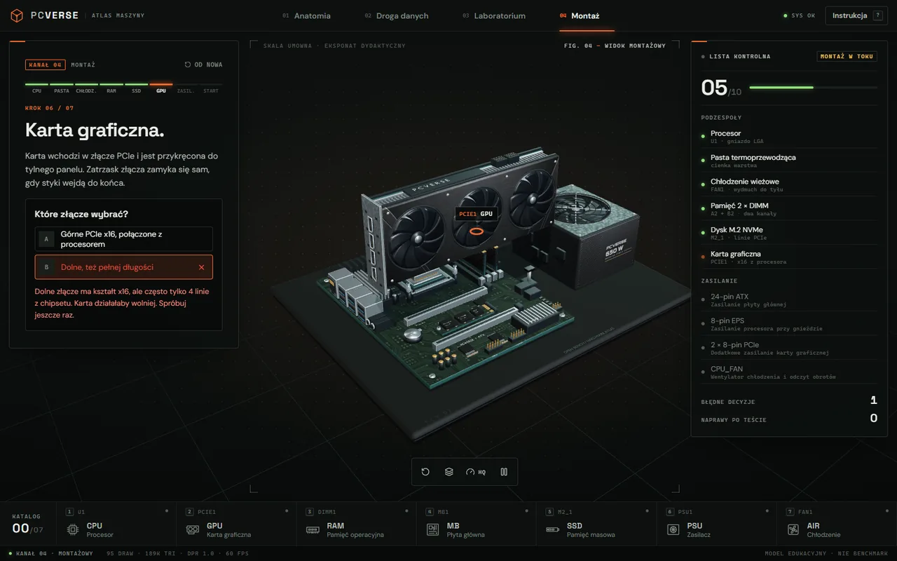

Złóż komputer w kolejności serwisanta: procesor, pasta termoprzewodząca, chłodzenie, pamięć w gniazdach A2/B2, dysk M.2, karta w górnym złączu PCIe i cztery przewody zasilające. Każda część unosi się nad swoim gniazdem i opada po zamontowaniu, a w modelu pojawiają się tylko faktycznie podłączone przewody. Decyzje mają konsekwencje: pominięta pasta albo niepodłączony EPS wyjdą dopiero przy pierwszym uruchomieniu, z realistycznym objawem i diagnozą, np. „CPU Fan Error!”. Na płycie świecą prawdziwe diody diagnostyczne Q-LED: podczas testu zapalają się kolejno CPU, DRAM, VGA i BOOT, a przy usterce zostaje ta, na której start się zatrzymał.

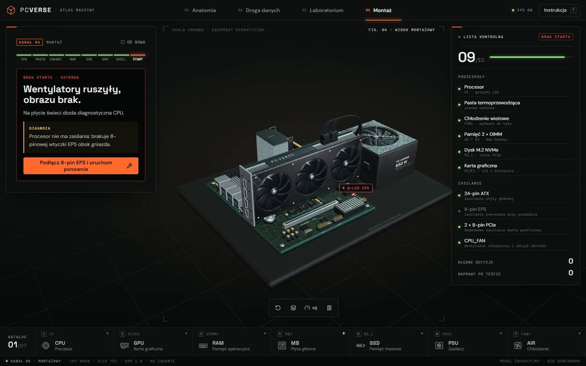

<table>
  <tr>
    <td width="42%">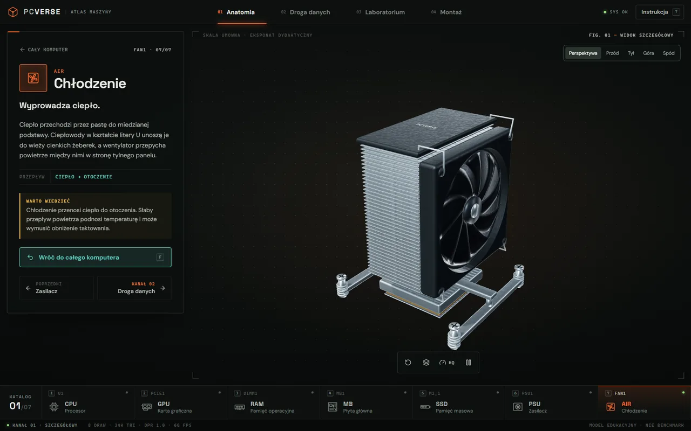</td>
    <td width="42%">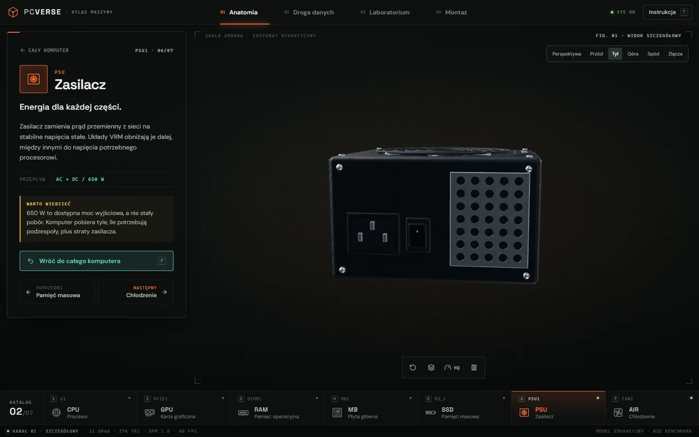</td>
    <td width="16%" rowspan="2">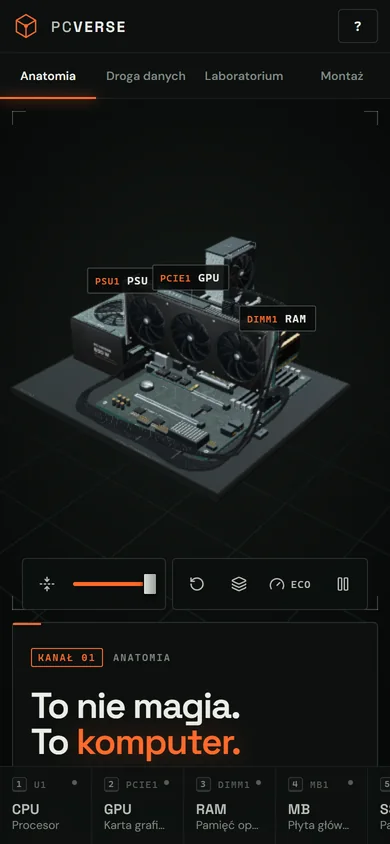</td>
  </tr>
  <tr>
    <td colspan="2">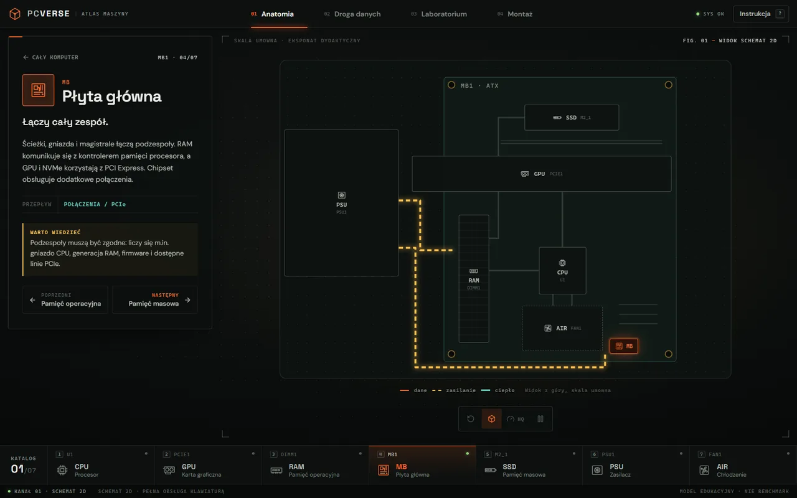</td>
  </tr>
</table>

## Jak powstało

- **Model w 100% ze skryptów.** Cała scena powstaje w Blenderze 5.2 z kodu Pythona (`scripts/build_atlas.py`), bez ręcznego klikania. Asercje pilnują realizmu i prześwitów: wieżowe chłodzenie z ciepłowodami U i wentylatorem na wlocie, karta prostopadła do płyty w złączu PCIe, zasilacz ATX z gniazdami modułowymi z przodu i gniazdem IEC z tyłu, pamięci w gniazdach A2/B2, osobne wiązki ATX 24-pin, EPS 8-pin i PCIe.
- **Detale materiałów i konstrukcji.** Otwarte wentylatory mają osobne profile łopatek CPU/GPU/PSU, a za nimi widać radiator lub wnętrze zasilacza. Obudowa PSU ma wycięte szczeliny, śruby i napisy w geometrii; GPU ma przetłoczenia i zagłębione mocowania. Płyta korzysta z bogatej tekstury laminatu i cieni kontaktowych dopasowanych do jej stałych elementów. SSD ma osobną teksturę ścieżek po obu stronach, a od spodu tabliczkę znamionową z kodem 2D, kodem kreskowym i akcentem barwnym. Procesor ma wytrawione parametry, a złącza PCIe — punkty lutownicze na spodzie płyty, tak jak gniazda pamięci. Grzebień EPS obejmuje rzeczywisty przekrój przewodów. Mapy mikrostruktury mają wspólną skalę fizyczną, niezależną od nadruków. Źródła tekstur i prompty ImageGen: [PSU / v5](art/textures/PROVENANCE-v5.md), [PCB i SSD / v6](art/textures/PROVENANCE-v6.md).
- **Lekko mimo szczegółów.** 228 793 trójkątów skompresowanych meshoptem z 15,53 MiB do 4,78 MiB. Powtarzane UV są kompresowane do 16 bitów z zachowaniem skali przez `KHR_texture_transform`. Dekoder jest w bundlu, więc strona nie łączy się z żadnym CDN. Cienie są przeliczane tylko przy ruchu, a gdy nikt nie korzysta ze strony, wentylatory zwalniają i scena przestaje renderować.
- **Interfejs jak przyrząd pomiarowy.** Ciemny stół serwisowy, ekran startowy w stylu BIOS z prawdziwym postępem ładowania, oznaczenia części jak na PCB (U1, PCIE1, DIMM1), skróty klawiszowe (A/D/L/M, 1–7, E, F, R, Spacja, ?).
- **Dostępny.** Schemat 2D bez WebGL (`?2d`), pełna obsługa klawiaturą, `prefers-reduced-motion`, ręczna pauza animacji i układ mobilny.
- **Sprawdzane automatycznie.** 30 testów symulacji, logiki montażu i diagnostyki, tras przewodów oraz skompresowanego modelu uruchamia CI przed każdym wdrożeniem na GitHub Pages. Testy geometrii sprawdzają również otwarte wentylatory, fizyczne wycięcia kluczy RAM/PCIe, jednorzędowe złącza wentylatorów, osadzenie elementów SSD, dopasowanie grzebienia EPS i zachowanie mapowania tekstur po kompresji.

To model dydaktyczny, nie benchmark: wyniki są uproszczonym modelem zależności, a skala eksponatu jest umowna.

## Uruchomienie

Wymagany Node.js 22.18+ (zalecany 24).

```sh
npm ci
npm run dev        # http://localhost:5173/pcverse-v2/
npm test
npm run build      # wynik w dist/
```

Przebudowa modelu (wymaga Blendera 5.2 w PATH, ok. 6 min):

```sh
npm run model:build     # scena w Blenderze + kompresja
npm run model:optimize  # sama kompresja art/export/atlas.raw.glb
```

Układ eksponatu: `finish_atlas.py` obraca cały zespół płyty o 180° wokół osi pionowej, tak aby tylne I/O i wyjścia GPU były skierowane na zewnątrz (+X). Zasilacz jest odsunięty o 0,75 jednostki, a jego przesunięcie zapisane w dzieciach — korzenie podzespołów pozostają w początku układu na potrzeby animacji montażu. Statyczne wiązki ATX/EPS oraz podpora GPU powstają bezpośrednio w nowym układzie. Trasy ruchomych przewodów są w `src/atlas/harness.ts`; po zmianie rozmieszczenia trzeba również dopasować etykiety w `content.ts`, kadry i przepływ powietrza w `AtlasScene.tsx` oraz przebudować i przetestować GLB.

## Struktura

```
src/App.tsx      stan, układ, skróty klawiszowe
src/ui/          panele, schemat 2D, telemetria, ekran startowy
src/atlas/       scena 3D, treść, symulacja, logika montażu, trasy przewodów, fonty
public/          model GLB, mapa HDR, obraz podglądu
scripts/         potok modelu (Blender, optymalizacja) i testy
art/textures/    źródła tekstur powierzchni
docs/            zrzuty do README
```

## Zasoby

- Fonty DM Sans i Space Grotesk na licencji SIL Open Font License, serwowane lokalnie.
- Mapa środowiska `studio_small_03` z Poly Haven (CC0).
- Tekstury powierzchni wygenerowane narzędziem AI na potrzeby projektu; mapy normalnych i chropowatości generowane matematycznie.

---

© 2026 [apkmasondev](https://github.com/apkmasondev). Wszelkie prawa zastrzeżone. Kod jest publiczny do wglądu. Chcesz wykorzystać projekt albo zamówić podobny? Zajrzyj na [apkmason.dev](https://apkmason.dev).
